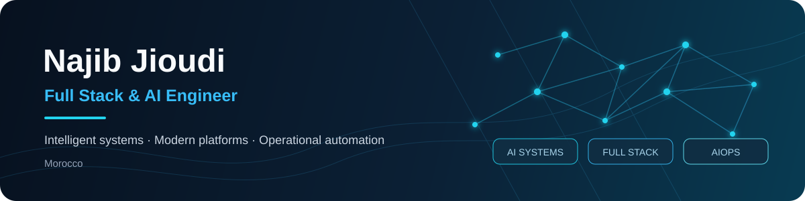

### I build intelligent software that connects AI with real-world operations.

Full Stack & AI Engineer focused on **LLM applications, RAG, AI agents, microservices, observability and automation**.

[LinkedIn](https://www.linkedin.com/in/najib-jioudi/)

---

## About

I am an engineer in **Computer Science and Networks** who enjoys taking ideas from architecture to production.

My work combines modern full-stack development with applied AI: designing APIs and microservices, building clean user interfaces, orchestrating intelligent workflows, and making systems observable, secure and maintainable.

> **Current focus:** reliable AI systems, AIOps, local LLMs, multimodal applications and self-improving agent workflows.

---

## What I Work On

<table>
<tr>
<td width="33%" valign="top">
<h3>AI Engineering</h3>
LLM applications, RAG pipelines, agents, local inference, multimodal analysis and evaluation.
</td>
<td width="33%" valign="top">
<h3>Full-Stack Systems</h3>
Modern interfaces, backend APIs, microservices, authentication, databases and scalable architecture.
</td>
<td width="33%" valign="top">
<h3>AIOps & Automation</h3>
Monitoring, incident analysis, workflow orchestration, observability and human-approved remediation.
</td>
</tr>
</table>

---

## Selected Projects

### [Real-Time Anti-Cheating & Proctoring System](https://github.com/najibjioudi/anti_cheat_sys)

AI-powered exam monitoring with real-time facial tracking, gaze analysis, behavioral rules and WebSocket video processing.

`FastAPI` `React` `OpenCV` `MediaPipe` `WebSockets`

### [Multilingual Symptom AI Assistant](https://github.com/najibjioudi/symptom_ai_assis_backend)

A multilingual assistant built around a microservice architecture, secure user management, conversational AI, speech-to-text and text-to-speech services.

`Spring Boot` `Spring Cloud` `Python` `MySQL` `JWT` `STT / TTS`

### [Secure E-Voting Platform](https://github.com/najibjioudi/mini_projet_e_voting)

A full-stack electronic voting platform with distributed services, identity verification, role-based security and real-time election management.

`Java` `Spring Boot` `React` `TypeScript` `OCR` `Microservices`

---

## Technology Stack

**AI & Data**

<kbd>Python</kbd> <kbd>LangGraph</kbd> <kbd>RAG</kbd> <kbd>LLM Agents</kbd> <kbd>Ollama</kbd> <kbd>ChromaDB</kbd> <kbd>FAISS</kbd> <kbd>OpenCV</kbd>

**Backend & Architecture**

<kbd>FastAPI</kbd> <kbd>Java</kbd> <kbd>Spring Boot</kbd> <kbd>Spring Cloud</kbd> <kbd>Temporal</kbd> <kbd>REST APIs</kbd> <kbd>Microservices</kbd>

**Frontend**

<kbd>React</kbd> <kbd>TypeScript</kbd> <kbd>Material UI</kbd> <kbd>Vite</kbd>

**Infrastructure & Observability**

<kbd>Docker</kbd> <kbd>Linux</kbd> <kbd>MySQL</kbd> <kbd>OpenSearch</kbd> <kbd>OpenTelemetry</kbd> <kbd>Jaeger</kbd> <kbd>Zabbix</kbd> <kbd>Jira</kbd>

---

## Currently Exploring

- Self-improving AI systems that evaluate and refine their own workflows
- Efficient communication protocols for multi-agent systems
- Multimodal AI that converts technical videos into structured procedures
- Reliable local AI using compact open-source models

---

## GitHub Activity

  

---

### Let’s build software that is intelligent, useful and dependable.

[LinkedIn](https://www.linkedin.com/in/najib-jioudi/)

